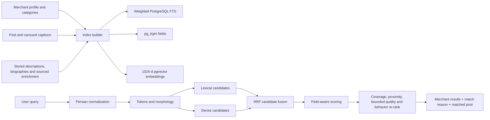

# Kahoo search core: flow, ranking, and operations

Updated: 2 October 2026

This document is the source of truth for Kahoo's merchant and product-discovery
search. The core is deliberately hybrid: exact Persian commerce queries must
work without an AI service, while multilingual embeddings add semantic recall
when configured.

## End-to-end flow



The architecture follows the candidate-generation, scoring, and re-ranking
separation used in production recommendation/search systems. Candidate sources
are not allowed to dictate final order directly because their score scales are
not comparable.

## 1. Ingestion and indexing

`sync_search_documents()` builds two document types:

- `merchant`: shop name, handle, categories, city, description, biography, and
  curated/enriched search terms.
- `post`: merchant identity/categories plus one Instagram post or carousel
  caption. Carousel images share one searchable post document.

Every document has:

- `title_content`: high-precision identity and category text, PostgreSQL weight
  `A`;
- `body_content`: descriptions, biographies, enrichment terms, and captions,
  PostgreSQL weight `B`;
- `content`: the combined normalized text used by trigram and embeddings;
- `content_hash`: invalidates an embedding only when content changes;
- `published_at`: enables a small freshness preference for equally relevant
  post matches;
- a 1024-dimensional vector when semantic search is enabled.

The indexer removes orphaned post documents and preserves unchanged vectors.
Changing `EMBEDDING_MODEL` makes old-model vectors pending automatically.

## 2. Query understanding

The same canonicalizer is used for indexing, metadata, analytics, and queries:

1. Unicode NFKC normalization.
2. Arabic-to-Persian character normalization (`ي` → `ی`, `ك` → `ک`).
3. Persian and Arabic digit normalization.
4. Diacritic, tatweel, punctuation, and half-space handling.
5. Stopword removal.
6. Conservative Persian suffix variants (`ها`, `های`, `هایی`, `تر`, `ترین`).
7. Retrieve actual indexed text with full-text and trigram matching; optional embeddings supply semantic evidence. There is no manual alias expansion.

Aliases are weighted and never replace the original query. Exact user tokens
always remain the strongest lexical evidence.

## 3. Candidate generation

### Weighted lexical retrieval

PostgreSQL generates candidates from:

- prefix full-text search over the weighted `tsvector`;
- cover-density ranking (`ts_rank_cd`) for term frequency and proximity;
- `word_similarity` over title and body fields;
- `strict_word_similarity` over the complete document;
- exact normalized phrase presence;
- a small bounded freshness bonus for matched posts.

The best matching document is retained for each merchant. This means the API
knows whether a merchant matched through its profile or a specific product
post, and can return `matched_post_id` and a useful match explanation.
For the result card, that matched post/collection is moved to the first thumbnail
position so the visual evidence agrees with the query.

### Dense semantic retrieval

When `EMBEDDING_API_URL` is configured, the normalized query is embedded and
searched against the pgvector HNSW index with cosine distance. Iterative HNSW
scans are enabled so filters and per-merchant grouping do not prematurely
reduce recall.

The default model is `BAAI/bge-m3`: 1024 dimensions, multilingual, and no query
instruction required. Semantic failures are isolated; lexical search remains
available.

### Fusion

Lexical and dense ranks are combined with Reciprocal Rank Fusion using `k=60`.
RRF uses rank positions instead of incomparable raw scores and is robust when
one retriever is absent.

## 4. Final scoring and safeguards

Every candidate receives field-aware evidence:

| Signal | Relative intent |
|---|---|
| Merchant name/handle | strongest exact navigational match |
| Category hierarchy | strong product-type match |
| Description | strong catalog match |
| Search metadata | reviewed/enriched catalog terms |
| Biography | supporting merchant evidence |
| City | location intent |
| Post document | concrete product/post evidence |
| Dense similarity | semantic recall |

The final scorer adds:

- full query-token coverage, preventing one common word from winning a
  multi-concept query;
- ordered phrase proximity;
- sourced terms from stored merchant metadata;
- a bounded exact-query click signal over 90 days;
- a much smaller bounded merchant-quality tie-breaker.

Popularity cannot rescue an irrelevant result. Multi-token queries require
minimum lexical coverage unless semantic or document retrieval is strong.
Browse pages, unlike explicit search, use category-aware diversification so a
single segment does not monopolize the first screen.

## 5. Result explanations and experience

Results report the strongest human-readable reason:

- merchant name;
- product or post;
- category;
- catalog description/metadata;
- biography;
- location;
- semantic similarity;
- typo/near match.

Autocomplete is separate from retrieval and suggests merchants, categories,
extracted merchant terms, and historically successful queries. Empty-result recovery reuses those
suggestions rather than silently broadening to unrelated shops.

## 6. Embedding setup and reindexing

Configure an OpenAI-compatible embeddings endpoint:

```dotenv
EMBEDDING_API_URL=http://embedding-service:8000/v1/embeddings
EMBEDDING_API_KEY=
EMBEDDING_MODEL=BAAI/bge-m3
```

Rebuild every changed document and embed all pending/stale-model rows:

```bash
docker compose run --rm app python3 -m scripts search reindex --batch-size 250 --all
```

Without `--all`, one embedding batch is processed. Without an embedding
endpoint, indexing still refreshes lexical documents and exits cleanly.

## 7. Relevance evaluation

Run the reviewed query set after any ranking or data change:

```bash
docker compose run --rm app python3 -m scripts search evaluate
```

The report contains:

- Success@5 and MRR@5 for first-useful-result quality;
- Recall@10 for breadth;
- nDCG@10 for graded/top-heavy ranking quality;
- zero-result rate;
- per-query and p50/p95 server latency;
- the top ten handles for regression inspection.

`data/search_benchmarks.json` accepts the existing `expected_handles` format or
a `relevance` map with graded judgments, for example:

```json
{"query":"کفش زنانه چرمی","relevance":{"@shop_a":3,"@shop_b":2,"@shop_c":1}}
```

Never tune only on clicks. Position bias and feedback loops favor shops that
were already shown. Add anonymized query/result/click judgments only after
manual review and retention/consent decisions.

## 8. Failure modes

- Missing Instagram posts reduce product-level recall, but profile/category
  retrieval still works.
- Missing embeddings disable only dense candidates.
- A failed embedding request is caught by the API search path; lexical results
  continue.
- Private or restricted profiles may never provide captions or images.
- A merchant with incomplete categories can still match its profile/post text,
  but category browsing and category explanations are weaker.

## 9. Evidence behind the design

- [PostgreSQL weighted text search and cover-density ranking](https://www.postgresql.org/docs/17/textsearch-controls.html)
- [PostgreSQL text-search functions and phrase queries](https://www.postgresql.org/docs/current/functions-textsearch.html)
- [PostgreSQL pg_trgm word similarity](https://www.postgresql.org/docs/15/pgtrgm.html)
- [pgvector hybrid search and iterative scans](https://github.com/pgvector/pgvector)
- [Reciprocal Rank Fusion paper](https://cormack.uwaterloo.ca/cormacksigir09-rrf.pdf)
- [BGE-M3 paper](https://arxiv.org/abs/2402.03216)
- [Official BGE-M3 model card](https://huggingface.co/BAAI/bge-m3)
- [Google candidate generation, scoring, and re-ranking architecture](https://developers.google.com/machine-learning/recommendation/overview/types)
- [TREC Deep Learning evaluation guidance](https://trec.nist.gov/pubs/trec29/papers/OVERVIEW.DL.pdf)

## 10. Next evidence-gated upgrades

Only add these after the expanded benchmark proves an improvement:

1. A multilingual cross-encoder reranker for the top 30–50 hybrid candidates.
2. BGE-M3 sparse vectors or SPLADE as a third candidate generator.
3. Query/category-specific learning-to-rank from debiased judgments.
4. Availability, price, size, color, and gender facets extracted into typed
   fields and confirmed by merchants.
5. Session recommendations with explicit consent and controlled retention.
